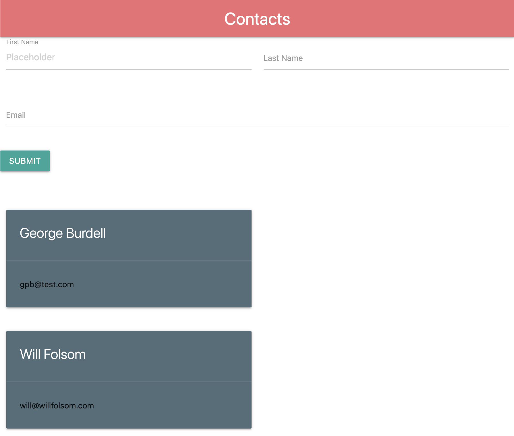
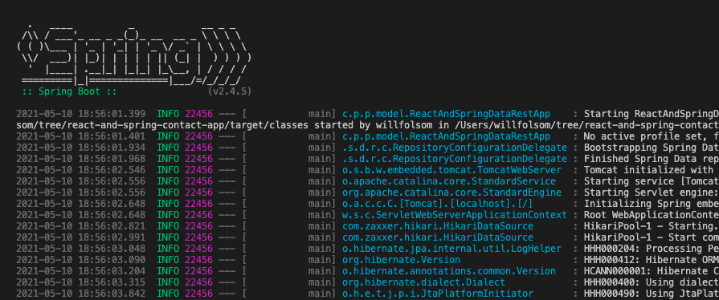

# React and Spring Contact App
A fullstack contacts creation app using React (with Typescript) and Spring, from the LinkedIn course "Building Full-Stack Apps with React and Spring". Uses Materialize UI for styling.




I deleted a lot of the boilerplate. I did not spend time making it any prettier. 😉

I also added Typescript and updated the refs functionality that was deprecated. Here's a hint on what that looks like in `AddContacts.tsx`:

```
    firstNameRef: RefObject<any>;
    lastNameRef: RefObject<any>;
    emailRef: RefObject<any>;

    constructor(props: any) {
        super(props);
        this.firstNameRef = React.createRef();
        this.lastNameRef = React.createRef();
        this.emailRef = React.createRef();
    }
```

-----

### Running
You must have JDK 11 installed, and npm and such.

Client: ```cd src/client/; npm i; npm run start;```

Server is run directly from the `main` function in `ReactAndSpringDataRestApp.java`.

Data only persists for as long as the server is running.
